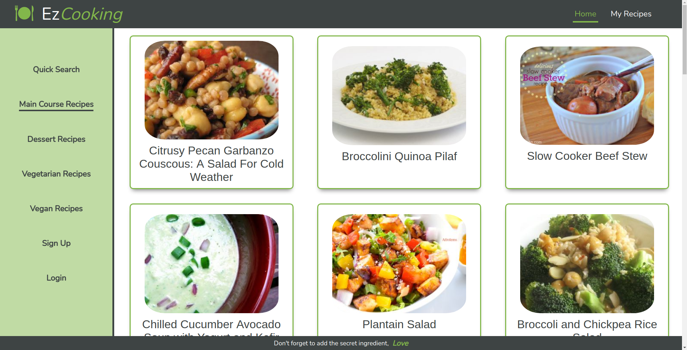
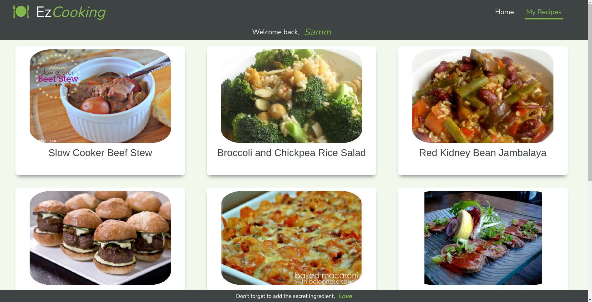
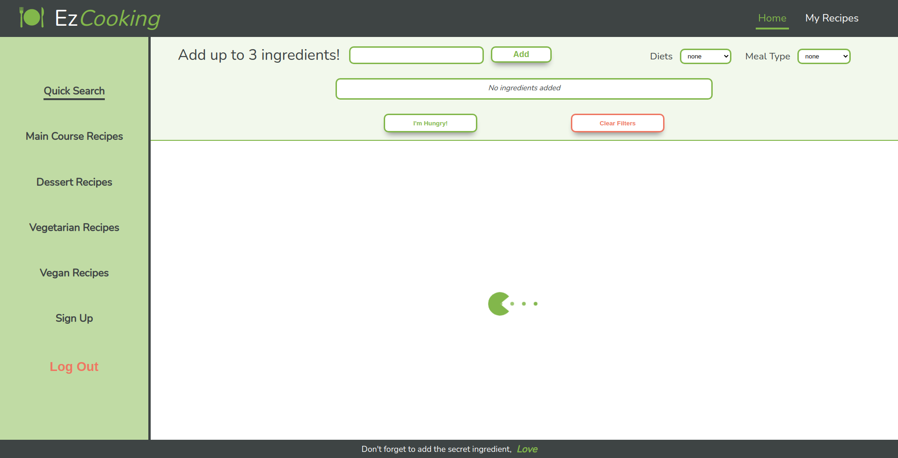

Hello Everyone and welcome to my final project' Repo! I built this web app from scratch as a final project for Concordia University' Bootcamp (in Montreal). It was my first real Full-Stack project!

INTRO

This web app was design mobile first but can run smoothly on a desktop aswell. 

On the Front-End, this app uses HTLM5, CSS, React, Redux & Styled-Components

On the Back-End, this app uses Node, Express & Firebase

The API used can be found at this website: https://spoonacular.com/food-api . The API was great, but the free tier was very limited as far as daily usages. Would still recommend tho!

Visit the website at this URL : https://ez-cooking.netlify.app

To deploy the FE, I used Netlify, and for the BE, I used Heroku.

ABOUT THE WEBSITE
Ez-Cooking is a recipe finder application. You can use an extensive amount of filters to find the perfect meal for you. It is free, and a subscription is not required. If you do subcribe however, you will be able to save your favorite recipes. The app was design to be very easy to use on both phone and desktop!

REACT/REDUX
The app was created using create-react-app. It uses functional components. I used both Context API and the Redux store. The useContext is mostly used to manage all the states of the web app and redux is used to store the data (recipes) received from my Backend and dispatch it throught out the website. Other hooks used are useState & useEffect.

CSS
I used styled component for all my components, my global variables and my global animations.

Here is a link for more infos on the Back-End. https://github.com/SamuelSTPL/Ez_Cooking_BE

Here you can see how filters work and how recipes are displayed. 

A demo of the hamburger menu and login/ sign up.

How the desktop version looks like.

